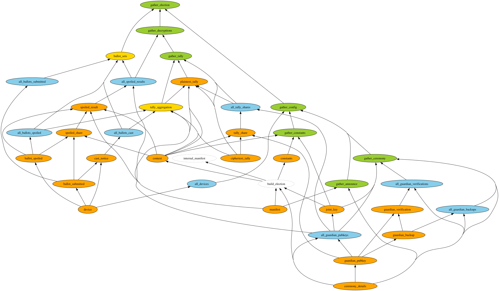

Verifier Script
===============

<a href="https://asciinema.org/a/763724" target="_blank"></a>

[](https://asciinema.org/a/763724)

This verifies the results of the [election script](../election).

It's based on a dependency graph:

```bash
$ nix develop
$ dot -Tsvg deps.dot -o deps.svg
```



The idea is that when one artifact fails to verify, that failure should spread to any other checks that depend on it, but we should also still verify as many properties of the election as we can without it.

Example usage with valid election data:

```bash
$ nix develop
$ # run ../election/election.py first to generate the public data
$ ./verify.py

docker exec verifier-verifier1-1 poetry run /scripts/verifier.py verify --public-dir /data/public --verifier-id verifier1

Verifying announcement:
✅ manifest
✅ ceremony_details

Verifying key ceremony:
✅ guardian_pubkey {'guardian_id': 'guardian_1'}
✅ guardian_pubkey {'guardian_id': 'guardian_2'}
✅ guardian_pubkey {'guardian_id': 'guardian_3'}
✅ guardian_backup {'guardian_id': 'guardian_1', 'backup_order': 2}
✅ guardian_backup {'guardian_id': 'guardian_1', 'backup_order': 3}
✅ guardian_backup {'guardian_id': 'guardian_2', 'backup_order': 1}
✅ guardian_backup {'guardian_id': 'guardian_2', 'backup_order': 3}
✅ guardian_backup {'guardian_id': 'guardian_3', 'backup_order': 1}
✅ guardian_backup {'guardian_id': 'guardian_3', 'backup_order': 2}
✅ guardian_verification {'guardian_id': 'guardian_1', 'backup_order': 2}
✅ guardian_verification {'guardian_id': 'guardian_1', 'backup_order': 3}
✅ guardian_verification {'guardian_id': 'guardian_2', 'backup_order': 1}
✅ guardian_verification {'guardian_id': 'guardian_2', 'backup_order': 3}
✅ guardian_verification {'guardian_id': 'guardian_3', 'backup_order': 1}
✅ guardian_verification {'guardian_id': 'guardian_3', 'backup_order': 2}

Verifying election constants:
✅ joint_key
✅ constants
✅ internal_manifest
✅ context

Verifying 4 encryption devices:
✅ device {'device_number': 1}
✅ device {'device_number': 2}
✅ device {'device_number': 3}
✅ device {'device_number': 4}

Verifying 12 submitted ballots:
✅ ballot_submitted {'ballot_id': 'ballot-4d8a0600-01cf-11f0-ba88-0242ac120008'}
✅ ballot_submitted {'ballot_id': 'ballot-4f17c912-01cf-11f0-b9d3-0242ac120009'}
✅ ballot_submitted {'ballot_id': 'ballot-50aaaa60-01cf-11f0-8d07-0242ac120002'}
✅ ballot_submitted {'ballot_id': 'ballot-4e0e2caa-01cf-11f0-b5b1-0242ac120004'}
✅ ballot_submitted {'ballot_id': 'ballot-523e490e-01cf-11f0-93ca-0242ac120004'}
✅ ballot_submitted {'ballot_id': 'ballot-51bb9838-01cf-11f0-a358-0242ac120008'}
✅ ballot_submitted {'ballot_id': 'ballot-4e920b7e-01cf-11f0-85e2-0242ac120002'}
✅ ballot_submitted {'ballot_id': 'ballot-50239f34-01cf-11f0-8e09-0242ac120004'}
✅ ballot_submitted {'ballot_id': 'ballot-5133d8c6-01cf-11f0-baeb-0242ac120009'}
✅ ballot_submitted {'ballot_id': 'ballot-4d065d14-01cf-11f0-8606-0242ac120009'}
✅ ballot_submitted {'ballot_id': 'ballot-4f9eb8d2-01cf-11f0-8d7f-0242ac120008'}
✅ ballot_submitted {'ballot_id': 'ballot-4c827dfa-01cf-11f0-b1ed-0242ac120002'}

Verifying 6 cast ballots:
✅ cast_notice {'ballot_id': 'ballot-4d8a0600-01cf-11f0-ba88-0242ac120008'}
✅ cast_notice {'ballot_id': 'ballot-4e0e2caa-01cf-11f0-b5b1-0242ac120004'}
✅ cast_notice {'ballot_id': 'ballot-523e490e-01cf-11f0-93ca-0242ac120004'}
✅ cast_notice {'ballot_id': 'ballot-50239f34-01cf-11f0-8e09-0242ac120004'}
✅ cast_notice {'ballot_id': 'ballot-4d065d14-01cf-11f0-8606-0242ac120009'}
✅ cast_notice {'ballot_id': 'ballot-4f9eb8d2-01cf-11f0-8d7f-0242ac120008'}

Verifying 6 spoiled ballots:
✅ ballot_spoiled {'ballot_id': 'ballot-4f17c912-01cf-11f0-b9d3-0242ac120009'}
✅ ballot_spoiled {'ballot_id': 'ballot-50aaaa60-01cf-11f0-8d07-0242ac120002'}
✅ ballot_spoiled {'ballot_id': 'ballot-51bb9838-01cf-11f0-a358-0242ac120008'}
✅ ballot_spoiled {'ballot_id': 'ballot-4e920b7e-01cf-11f0-85e2-0242ac120002'}
✅ ballot_spoiled {'ballot_id': 'ballot-5133d8c6-01cf-11f0-baeb-0242ac120009'}
✅ ballot_spoiled {'ballot_id': 'ballot-4c827dfa-01cf-11f0-b1ed-0242ac120002'}

Verifying 6 spoiled ballot decyptions:
✅ spoiled_result {'ballot_id': 'ballot-4f17c912-01cf-11f0-b9d3-0242ac120009'}
✅ spoiled_result {'ballot_id': 'ballot-50aaaa60-01cf-11f0-8d07-0242ac120002'}
✅ spoiled_result {'ballot_id': 'ballot-51bb9838-01cf-11f0-a358-0242ac120008'}
✅ spoiled_result {'ballot_id': 'ballot-4e920b7e-01cf-11f0-85e2-0242ac120002'}
✅ spoiled_result {'ballot_id': 'ballot-5133d8c6-01cf-11f0-baeb-0242ac120009'}
✅ spoiled_result {'ballot_id': 'ballot-4c827dfa-01cf-11f0-b1ed-0242ac120002'}

Verifying ballot ID sets:
✅ 6 ballots spoiled = 6 ballots decrypted
✅ 6 ballots cast + 6 ballots spoiled = 12 ballots submitted
✅ set(spoiled ballot IDs) = set(decrypted ballot IDs)
✅ set(cast ballot IDs) + set(spoiled ballot IDs) = set(submitted ballot IDs)

Verifying final tally:
✅ ciphertext_tally format is valid
✅ ciphertext_tally is the correct aggregation of the 6 cast ballots
✅ plaintext_tally format is valid
✅ plaintext_tally guardian decryption shares are valid

----------------------------------------
Individual spoiled ballots
----------------------------------------

4f17c912-01cf-11f0-b9d3-0242ac120009
  Are pineapples cool? No

50aaaa60-01cf-11f0-8d07-0242ac120002
  Are pineapples cool? Unsure

51bb9838-01cf-11f0-a358-0242ac120008
  Are pineapples cool? Unsure

4e920b7e-01cf-11f0-85e2-0242ac120002
  Are pineapples cool? No

5133d8c6-01cf-11f0-baeb-0242ac120009
  Are pineapples cool? Unsure

4c827dfa-01cf-11f0-b1ed-0242ac120002
  Are pineapples cool? Yes

----------------------------------------
Final tally of cast ballots
----------------------------------------

Are pineapples cool?
  Yes: 3
  No: 2
  Unsure: 1

🎉 The election has been verified!
```

And an example of it failing because I manually removed one of the submitted ballots:

```bash
$ ./verify.py
# ... mostly same output as above ...

----------------------------------------
Final tally of cast ballots
----------------------------------------

Are pineapples cool?
  Yes: 3
  No: 2
  Unsure: 1

⛔ The election could NOT be verified!
⛔ There were 9 errors.
⛔ See verifier1.json for details.

$ cat ../election/data/public/4_verify/verifier1.json | jq
```

```json
{
  "Verified": false,
  "Errors": {
    "ballot_submitted": {
      "ballot-50aaaa60-01cf-11f0-8d07-0242ac120002": "[Errno 2] No such file or directory: '/data/public/2_ballots/1_submitted/ballot-50aaaa60-01cf-11f0-8d07-0242ac120002.json'"
    },
    "ballot_spoiled": {
      "ballot-50aaaa60-01cf-11f0-8d07-0242ac120002": "dependencies failed: ballot_submitted"
    },
    "all_ballots_spoiled": "dependencies failed: ballot-50aaaa60-01cf-11f0-8d07-0242ac120002",
    "n_spoiled_decrypted": "dependencies failed: all_ballots_spoiled",
    "n_cast_spoiled_submitted": "dependencies failed: all_ballots_spoiled",
    "set_spoiled_decrypted": "dependencies failed: all_ballots_spoiled",
    "set_cast_spoiled_submitted": "dependencies failed: all_ballots_spoiled",
    "ballot_sets": "dependencies failed: n_cast_spoiled_submitted, n_spoiled_decrypted, set_cast_spoiled_submitted, set_spoiled_decrypted",
    "gather_election": "dependencies failed: ballot_sets"
  },
  "Final tally of cast ballots": [
    {
      "question": "Are pineapples cool?",
      "votes": {
        "Yes": 3,
        "No": 2,
        "Unsure": 1
      }
    }
  ],
  "Individual spoiled ballots": {
    "4f17c912-01cf-11f0-b9d3-0242ac120009": [
      {
        "Are pineapples cool?": "No"
      }
    ],
    "50aaaa60-01cf-11f0-8d07-0242ac120002": [
      {
        "Are pineapples cool?": "Unsure"
      }
    ],
    "51bb9838-01cf-11f0-a358-0242ac120008": [
      {
        "Are pineapples cool?": "Unsure"
      }
    ],
    "4e920b7e-01cf-11f0-85e2-0242ac120002": [
      {
        "Are pineapples cool?": "No"
      }
    ],
    "5133d8c6-01cf-11f0-baeb-0242ac120009": [
      {
        "Are pineapples cool?": "Unsure"
      }
    ],
    "4c827dfa-01cf-11f0-b1ed-0242ac120002": [
      {
        "Are pineapples cool?": "Yes"
      }
    ]
  }
}
```

TODO:

- [x] Monkey patch the electionguard LOG to throw exceptions during verification
      (because throwing them all the time messes with the test suite)
- [x] Make a JSON summary of the verification as well as printing
- [x] Clean up the code! It's very messy so far
- [x] Have this script create the election summary json rather than admin.py
