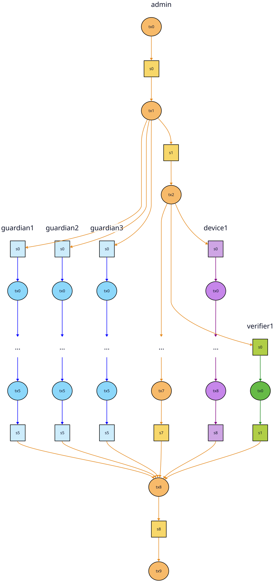

# ElectionGuard + Cardano Design

This is mostly about the smart contract, because is's both more important and better defined than the off-chain code. There are examples of all the [off-chain data](#off-chain-data) formats too though.

_On Github, click the hamburger icon to show the table of contents &#8599;

## Motivation

In this first MVP version of the ElectionGuard + Cardano system, the on-chain code serves two purposes, both related to limiting the power of the government (AKA election administrator) by decentralizing some of their duties:

1. The contract acts as the "public, append-only bulletin board". In traditional non-blockchain ElectionGuard deployments, this would just be a website. Decentralizing it removes the temptation for the admin to alter records or take the site down if they don't like how the election is going, and reduces their exposure to being hacked or DDOSed.

2. The contract also makes it easier for the head administrator to delegate authority. Instead of one monolithic "election system" the public can see the admin assigning other keys to particular roles (guardian, ballot encryption device, official verifier) and knows which one(s) signed each election artifact.

There are many other things the blockchain would also be useful for, but they're left for future iterations:

- uncensorable disputes and transparent dispute resolution
- provably random (unbiased) risk-limiting audits
- collateral/slashing to improve trust in election officials
- incentives for 3rd parties to serve IPFS data and run verifiers + dashboards
- ...

## Smart Contract Tour

See also [Dev Update #5 on YouTube](https://www.youtube.com/watch?v=zWpfJSx9b1I).

### Source Code

Here's an overview of all the validator code so far.
It's split into the production code and the test suite:

```
validators
├── election.ak           # The main validator
├── election              # Definitions factored out of the main validator
│   ├── *.ak              # Somewhat-modular functions grouped by topic
│   └── types/*.ak        # Data types and functions for working on them
└── tests
    ├── mock.ak           # Library of test helper functions
    ├── action/*.ak       # Single-action tests
    ├── data/*.ak         # Static election artifacts generated by a Python script
    ├── integration/*.ak  # Integration tests
    └── unit/*.ak         # Unit tests
```

Within the production code [election.ak](./validators/election.ak) is the main validator. Data types are defined in [election/types](./validators/election/types/), and the rest of the code is under [election](./validators/election/) grouped roughly by "aspect".

The test suite is organized into [mock.ak](./validators/tests/mock.ak) which is a little library of helper functions; `data`, which holds statically generated test data; and then the rest of the folders are tests by type:

- [unit tests](./validators/tests/unit/)
- [integration tests](./validators/tests/integration/)
- [single-action tests](./validators/tests/action/)

The current integration tests are "happy path" tests that confirm the full contract lifecycle works. They start with `happy_`. Later, others can be added to check that the validator rejects all attempts at invalid state transitions. The happy path tests are a good starting point for that, because each invalid state can be reached by starting from one of the valid states and doing one thing wrong.

### Running the tests

You can run specific tests with trace statments,
which is very useful for debugging:

```
$ nix develop .#onchain
running devShells.x86_64-linux.onchain shellHook
aiken version: aiken v1.1.21+42babe5

$ ./check.sh -m admin_tx0
+ set -e
++ dirname ./check.sh
+ cd .
+ args='-m admin_tx0'
+ [[ -z -m admin_tx0 ]]
+ aiken check -m admin_tx0
    Compiling jefdaj/electionguard-cardano 0.1.0 (.)
    Resolving jefdaj/electionguard-cardano
      Fetched 1 package in 2.89s from cache
    Compiling aiken-lang/stdlib 3.0.0 (./build/packages/aiken-lang-stdlib)
    Compiling aiken-lang/fuzz v2 (./build/packages/aiken-lang-fuzz)
   Collecting test *admin_tx0* across all modules
      Testing ...

    ┍━ tests/integration/happy_election.tests ━━━━━━━━━━━━━━━━━━━━
    │ PASS [mem: 248.23 K, cpu:  81.14 M] happy_election_admin_tx0
    │ · with traces
    │ | validate_mint
    │ | validate_admin_channel_mint
    │ | initelection branch
    │ | exact_channels_minted
    │ | check_exact_mint_burn
    │ | full_stt_name
    │ | validate_spend
    │ | ada_retained_during_election
    │ | validate_initelection_spend
    │ | get_initial_state
    │ | full_stt_name
    │ | is_initial_phase
    ┕━━━━━━━━━━━━━━━━━━━━━━━━━━━━━━━ 1 tests | 1 passed | 0 failed

      Summary 1 check, 0 errors, 0 warnings
```

Or the entire test suite:

```
$ ./check.sh
+ set -e
++ dirname ./check.sh
+ cd .
+ args=
+ [[ -z '' ]]
+ args='--trace-level silent'
+ aiken check --trace-level silent
    Compiling jefdaj/electionguard-cardano 0.1.0 (.)
    Resolving jefdaj/electionguard-cardano
      Fetched 1 package in 0.02s from cache
    Compiling aiken-lang/stdlib 3.0.0 (./build/packages/aiken-lang-stdlib)
    Compiling aiken-lang/fuzz v2 (./build/packages/aiken-lang-fuzz)
   Collecting all tests scenarios across all modules
      Testing ...

    ┍━ tests/action/burntesttokens.tests ━━━━━━━━━━━
    │ PASS [after 100 tests] prop_can_burn_happy_stt
    │ PASS [after 100 tests] prop_can_burn_happy_stts
    ┕ with --seed=2921660199 → 2 tests | 2 passed | 0 failed

    ┍━ tests/integration/happy_adminchannel.tests ━━━━━━━━━━━━━━━━━━━━━━━
    │ PASS [mem: 286.91 K, cpu:  99.66 M] happy_adminchannel_initelection
    │ PASS [mem: 541.53 K, cpu: 183.10 M] happy_adminchannel_advancephase_2
    │ PASS [mem: 551.28 K, cpu: 186.04 M] happy_adminchannel_advancephase_3
    │ PASS [mem: 561.72 K, cpu: 189.17 M] happy_adminchannel_advancephase_4
    │ PASS [mem: 563.23 K, cpu: 189.15 M] happy_adminchannel_advancephase_5
    │ PASS [mem: 559.47 K, cpu: 187.88 M] happy_adminchannel_advancephase_6
    │ PASS [mem: 579.13 K, cpu: 194.48 M] happy_adminchannel_advancephase_7
    │ PASS [mem: 583.14 K, cpu: 195.19 M] happy_adminchannel_advancephase_8
    │ PASS [mem: 580.97 K, cpu: 194.00 M] happy_adminchannel_advancephase_9
    │ PASS [mem: 393.07 K, cpu: 129.97 M] happy_adminchannel_endelection
    ┕━━━━━━━━━━━━━━━━━━━━━━━━━━━━━━━━━━━━━━ 10 tests | 10 passed | 0 failed

    ┍━ tests/integration/happy_election.tests ━━━━━━━━━━━━━━━━━━━━
    │ PASS [mem: 213.66 K, cpu:  72.47 M] happy_election_admin_tx0
    │ PASS [mem: 569.50 K, cpu: 190.79 M] happy_election_admin_tx1
    │ PASS [mem:   1.08 M, cpu: 355.76 M] happy_election_admin_tx2
    │ PASS [mem: 623.90 K, cpu: 206.55 M] happy_election_admin_tx3
    │ PASS [mem: 627.44 K, cpu: 208.05 M] happy_election_admin_tx4
    │ PASS [mem: 704.22 K, cpu: 235.87 M] happy_election_admin_tx5
    │ PASS [mem:   2.52 M, cpu: 723.77 M] happy_election_admin_tx6
    │ PASS [mem:   1.22 M, cpu: 396.04 M] happy_election_admin_tx7
    │ PASS [mem: 478.42 K, cpu: 161.85 M] happy_election_guardian1_tx1
    │ PASS [mem: 607.60 K, cpu: 205.49 M] happy_election_guardian1_tx2
    │ PASS [mem: 705.43 K, cpu: 239.65 M] happy_election_guardian1_tx3
    │ PASS [mem:   2.46 M, cpu: 711.28 M] happy_election_guardian1_tx4
    │ PASS [mem:   1.15 M, cpu: 377.40 M] happy_election_guardian1_tx5
    │ PASS [mem: 478.42 K, cpu: 161.85 M] happy_election_guardian2_tx1
    │ PASS [mem: 607.60 K, cpu: 205.49 M] happy_election_guardian2_tx2
    │ PASS [mem: 705.43 K, cpu: 239.65 M] happy_election_guardian2_tx3
    │ PASS [mem:   2.46 M, cpu: 711.28 M] happy_election_guardian2_tx4
    │ PASS [mem:   1.15 M, cpu: 377.40 M] happy_election_guardian2_tx5
    │ PASS [mem: 478.42 K, cpu: 161.85 M] happy_election_guardian3_tx1
    │ PASS [mem: 607.60 K, cpu: 205.49 M] happy_election_guardian3_tx2
    │ PASS [mem: 705.43 K, cpu: 239.65 M] happy_election_guardian3_tx3
    │ PASS [mem:   2.46 M, cpu: 711.28 M] happy_election_guardian3_tx4
    │ PASS [mem:   1.15 M, cpu: 377.40 M] happy_election_guardian3_tx5
    │ PASS [mem: 492.19 K, cpu: 165.04 M] happy_election_device1_tx1
    │ PASS [mem:   3.84 M, cpu:   1.05 B] happy_election_device1_tx2
    │ PASS [mem:   4.37 M, cpu:   1.22 B] happy_election_device1_tx3
    │ PASS [mem: 561.60 K, cpu: 183.62 M] happy_election_verifier1_tx1
    │ PASS [mem:   3.97 M, cpu:   1.32 B] happy_election_admin_tx8
    │ PASS [mem: 270.31 K, cpu:  87.50 M] happy_election_admin_tx9
    ┕━━━━━━━━━━━━━━━━━━━━━━━━━━━━━━━━━ 29 tests | 29 passed | 0 failed

    ┍━ tests/integration/happy_postpublicrecords.tests ━━━━━━━━━━━━━━━━
    │ PASS [mem: 553.03 K, cpu: 182.37 M] happy_postpublicrecords_admin
    │ PASS [mem: 442.42 K, cpu: 147.65 M] happy_postpublicrecords_subchannel
    ┕━━━━━━━━━━━━━━━━━━━━━━━━━━━━━━━━━━━━━━━━━ 2 tests | 2 passed | 0 failed

    ┍━ tests/integration/happy_subchannel.tests ━━━━━━━━━━━━━━━━━━━━━
    │ PASS [mem: 662.51 K, cpu: 221.30 M] happy_subchannel_single_add
    │ PASS [mem:   1.04 M, cpu: 350.29 M] happy_subchannel_single_rm
    │ PASS [mem:   2.03 M, cpu: 661.91 M] happy_subchannel_multi_add
    │ PASS [mem:   7.51 M, cpu:   2.62 B] happy_subchannel_multi_rm
    ┕━━━━━━━━━━━━━━━━━━━━━━━━━━━━━━━━━━ 4 tests | 4 passed | 0 failed

    ┍━ tests/unit/ballot_id.tests ━━━━━━━━━━━━━━━━━━━━━━━━━━━━━━
    │ PASS [mem:  59.42 K, cpu:  15.04 M] valid_hex_segment_test
    │ PASS [mem:  66.53 K, cpu:  16.85 M] invalid_hex_segment_test
    │ PASS [mem: 238.38 K, cpu:  59.94 M] valid_uuid_test
    │ PASS [mem: 247.53 K, cpu:  62.28 M] valid_ballot_id_test
    │ PASS [mem:   5.61 K, cpu:   1.36 M] invalid_prefix_test
    │ PASS [mem:  10.03 K, cpu:   2.51 M] invalid_format_test
    ┕━━━━━━━━━━━━━━━━━━━━━━━━━━━━━━━ 6 tests | 6 passed | 0 failed


    ┍━ tests/unit/ipfs_cid.tests ━━━━━━━━━━━━━━━━━━━━━━━━━━━━━━━━━━━━━━━
    │ PASS [mem: 964.12 K, cpu: 278.71 M] all_static_election_cids_valid
    │ PASS [mem:   4.10 K, cpu:   1.02 M] valid_cid_test
    │ PASS [mem:   4.10 K, cpu:   1.02 M] valid_cid_different_hash_test
    │ PASS [mem:   4.10 K, cpu:   1.02 M] valid_cid_zeros_test
    │ PASS [mem:   2.50 K, cpu: 612.24 K] invalid_length_short_test
    │ PASS [mem:   2.50 K, cpu: 612.24 K] invalid_length_long_test
    │ PASS [mem:   3.20 K, cpu: 800.29 K] invalid_version_v0_test
    │ PASS [mem:   3.20 K, cpu: 800.29 K] invalid_version_v2_test
    │ PASS [mem:   4.60 K, cpu:   1.17 M] invalid_hash_type_test
    │ PASS [mem:   4.60 K, cpu:   1.17 M] invalid_hash_length_declaration_test
    │ PASS [mem:   2.50 K, cpu: 612.24 K] invalid_empty_cid_test
    │ PASS [mem:   3.90 K, cpu: 988.34 K] invalid_codec_test
    │ PASS [mem:   4.10 K, cpu:   1.02 M] valid_cid_min_values_test
    │ PASS [mem:   4.10 K, cpu:   1.02 M] valid_cid_max_hash_test
    ┕━━━━━━━━━━━━━━━━━━━━━━━━━━━━━━━━━━━━━━━━━ 14 tests | 14 passed | 0 failed

    ┍━ tests/unit/record.tests ━━━━━━━━━━━━━━━━━━━━━━━━━━━━━━━━━━━━━━━━━━━━━
    │ PASS [mem:  13.11 M, cpu:   3.39 B] all_static_election_metadata_valid
    │ PASS [mem:  13.61 M, cpu:   3.52 B] all_static_election_records_valid
    ┕━━━━━━━━━━━━━━━━━━━━━━━━━━━━━━━━━━━━━━━━━ 2 tests | 2 passed | 0 failed

      Summary 267 checks, 0 errors, 0 warnings
```

### Visualizing the on-chain data

Cardano smart contracts can be tricky to visualize because they don't construct transactions; they only decide whether a given transaction is valid or not. So the simplest way to start is with an example of the data structure they're trying to force the off-chain code to create. In this case it's a multithreaded pubsub channel:



Each channel has a state thread token (STT), and each state `s0`, `s1`, ... `sN` contains a list of zero or more new public records. The channel state UTXO also carries a pool of ADA to pay for transaction fees (see [funding](#funding-transaction-fees)).

There's always one admin channel. The admin can post records to it, as well as update a couple other bits of special admin state, and mint or burn subchannel tokens.

Each subchannel has one authorized publisher, and the only thing they can do is to post public records.

### Public Records

Leaving the admin channel aside for a minute, most transactions are simple: one of the subchannel publishers posts a list of public records to their channel. In the case of a ballot encryption device, the list might look like:

```aiken
[
  PublicRecord {
    ipfs_cid: #"0155122023f9c548fcfc4d6cab3665aea8c1d4ab436cf284f34148cc8c32f3f0cff5b166",
    metadata: BallotSubmitted {
      ballot_id: to_bytearray(@"ballot-4b4fb8a6-1d64-11f1-a997-768fd7ed4145")
    }
  },
  PublicRecord {
    ipfs_cid: #"0155122017fd845417e179f8a0f8bb69fca3b3c428a14a97b3d6fc982390a372275acfcb",
    metadata: BallotSubmitted {
      ballot_id: to_bytearray(@"ballot-4c9f842a-1d64-11f1-94d0-768fd7ed4145")
    }
  },
  PublicRecord {
    ipfs_cid: #"01551220b2fe6231a43ea31a09df0e6277e8ebca319e77f089fa169053a264b6a9d13b9b",
    metadata: BallotSpoiled {
      ballot_id: to_bytearray(@"ballot-48b5dc74-1d64-11f1-9b1b-768fd7ed4145")
    }
  },
  PublicRecord {
    ipfs_cid: #"01551220f9bba653cd2cd599b0d83ae8965b7596dfc5875e2eee3161f0db89367f1c10e5",
    metadata: CastNotice {
      ballot_id: to_bytearray(@"ballot-4957f5fe-1d64-11f1-9226-768fd7ed4145")
    }
  }
]
```

That's two newly scanned ballots being submitted, one previously submitted ballot being "spoiled" (AKA audited or marked for public decryption) by the voter, and one previously submitted ballot being cast (marked for inclusion in the final tally) by the voter.

All records include an IPFS CID and some metadata. The possible metadata types are in [record.ak](./validators/election/types/record.ak).

Each update (datum) only includes the latest batch of `new_records`. Observers or other node operators need to run a Kupo indexer to get the full history. There's no way around the general requirement to run a custom node, because it also needs to fetch files via IPFS in order to confirm that the current election state is valid.

### Election Phases

Each election is broken into a series of standard phases defined in [phase.ak](./validators/election/types/phase.ak):

1. Config

    1. Announce
    2. Onboarding
    3. Key Ceremony

2. Voting
3. Results

     1. Tally
     2. Decrypt

4. Verify
5. Finalize

These are good for adding phase-specific logic to the contract. For example ADA can't be removed except by the admin during `Finalize` (see [funding](#funding-transaction-fees)). They'll also be useful for displaying progress in a future UI, and for controlling which actions are available to each person/role at any given time.

### Funding Transaction Fees

The contract is set up to minimize the amount of ADA that needs to be handled by election officials. The expected workflow is:

1. The admin locks a pool of ADA with each channel STT to pay for fees.
2. The admin sends a little more ADA to the channel publisher's wallet to be used as smart contract collateral (that can't be provided by a contract).
3. Posting records can be done for free using the channel's ADA pool.
4. If needed, the admin can top up a channel pool or rebalance between them at any point.
5. At the end of the election the admin can remove the remaining ADA. There could be custom treasury related logic here in the future.
6. There's currently no mechanism to recover the collateral; publishers can keep it.

Most of that will be handled by the off-chain code that constructs transactions, and by the Cardano ledger. The contract just ensures is that no one can take the ADA associated with a channel during the election. That's handled [here](./validators/election.ak#L428) and [here in fund.ak](./validators/election/fund.ak#L13). There's also a `RebalanceFunds` action for the admin, which is almost a no-op except that it needs to update the admin STT + each subchannel STT being rebalanced.

### Burning Test Tokens

When I first started working with the testnet, I accidentally made a few unspendable (or not easily spendable) test tokens. The current version of the contract includes a `BurnTestTokens` action (redeemer) to prevent that. Whenever one of the tests hits an unexpected issue, I'll run the burn script to clean it up. Obviously this part should be removed before production use!

### Admin actions

Now you know enough to understand [all the action (redeemer) types in action.ak](./validators/election/types/action.ak). They're grouped in the source code by which channels they touch, but would typically be used in this order by the admin:

1. InitElection
2. PostPublicRecords
3. AddSubChannels
4. AdvancePhase
5. PostPublicRecords
6. RmSubchannels
7. EndElection

### Channel State

There are two types of channel states, defined in [channel.ak](./validators/election/types/channel.ak): `AdminChannelState` and `SubChannelState`.

Both types have one `VerificationKeyHash` (wallet key) authorized to update them, but it's called `admin` in the admin channel and `publisher` in subchannels.

Both also have `new_records` lists that work the same way (they're replaced each update). They also have `seq` variables that will be used by clients subscribing to updates. They'll make it easy to check that no updates have been skipped, and easy to roll back in case the chain reorganizes.

The admin state has an extra `phase` variable as well as a `subchannels` list, while the subchannel state has a `channel_id`.

The admin channel posts a mix of channel/election related state updates, as well as public records. Subchannels only post public records.

### Test Election

The most useful and comprehensive test to look through is probably [happy_election.ak](./validators/tests/integration/happy_election.ak). I ran an election locally, [generated](../offchain/static_records_ak.py) Aiken code describing the [static records](./validators/tests/data/static_records.ak) from that election, and then manually wrote out every transaction and channel state needed to post them on chain. It's chopped up like this:

- initial solo admin transactions
- parallel admin transactions
- guardian1 transactions
- guardian2 transactions
- guardian3 transactions
- device1 transactions
- verifier1 transactions
- final admin transactions

You can run the entire test scenario at once, or pick out parts of it. See [running the tests](#running-the-tests).

## Off-Chain Data

### ElectionContext

```json
{
  "schema_version": 2,
  "script": {
    "oneshot_utxo": "828258202624b6cc5ed68fcb585e881159a0ccd7c403451e8c11a7a1a41700056009510e0082581d60cb10009c8bc74c7a136d5c13bb8aac60b51847d3e84cf7c7ba088d731a08c12b48",
    "oneshot_hex": "d8799f58202624b6cc5ed68fcb585e881159a0ccd7c403451e8c11a7a1a41700056009510e00ff",
    "aiken_blueprint": ...
    "aiken_tracing": true
  },
  "deployment": {
    "network": "testnet",
    "funder_address": "addr_test1vr93qqyu30r5c7snd4wp8wu243st2xz8605yea78hgyg6uckjakk5",
    "deployment_date": "2026-07-03T23:55:12.528731",
    "index_from_slot": 116492069,
    "index_from_block_hash": "53c07f8fa7ce9cd75f1139806afc5c36e11ea1d373a6abd30ba5bb5de6a14650"
  }
}
```

### Future QR Codes

The `ElectionContext` includes all the info that we might want for any reason.
Smaller amounts of info we need to transfer between nodes out-of-band can go in QR codes:

- slot number, block header hash, policy id for subscribing to an election
- requests to be authorized as an election official, with public wallet address
- unique session codes to prove to the challenge station that you're the voter who just submitted a particular ballot, and should now be allowed to cast or spoil it
- reciepts that can be taken home and used later to check that your vote was counted

None of the QR code formats are defined yet.
Only the (slot, hash, policy id) info used in the current code. It looks like:

```python
SubscriberConfig(since_slot='116492069',
                 since_block_hash='53c07f8fa7ce9cd75f1139806afc5c36e11ea1d373a6abd30ba5bb5de6a14650',
                 policy_id=ScriptHash(hex='fa4cc29d56e896561b94369831cd9e83d1faf8fea7868dc72729a95d'))
```

It will probably also need a network code in the future.


### Public Records

All the artifacts that should be posted on chain and uploaded to IPFS are formatted as `PublicRecord`s. A public record has an IPFS CID(v1) and some typed metadata.
The Python `PublicRecord`s are defined in terms of `PlutusData` and need to be kept in sync with the Aiken ones in order to round-trip the data via the blockchain. For example:

```aiken
er.PublicRecord {
  // orig base32: bafkreibttf67rmdea6gvgux7l4ongpd72cocduvmel65kevffiu5riahe4
  ipfs_cid: #"0155122033997df8b064078d5352ff5f1cd33c7fd09c21d2ac22fdd512a52a29d8a00727",
  metadata: er.BallotSubmitted { ballot_id: to_bytearray(@"ballot-480eed2e-1d64-11f1-ac1f-768fd7ed4145") }
}
```

```python
PublicRecord(
	ipfs_cid='bafkreibttf67rmdea6gvgux7l4ongpd72cocduvmel65kevffiu5riahe4',
	metadata=BallotSubmitted(ballot_id=b'ballot-480eed2e-1d64-11f1-ac1f-768fd7ed4145')
)
```

The actual records (Python objects) are serialized to JSON. That's what gets
added to IPFS and referred to by CID. Here's the JSON for that ballot,
indented + truncated to 80 chars for readability:

```json
{
  "object_id": "ballot-480eed2e-1d64-11f1-ac1f-768fd7ed4145",
  "style_id": "ballot-style-01",
  "manifest_hash": "5BC6C81DAC9557C3094B85EBF7443C8A0115CE55CEFFC496D03F93245D21
  "code_seed": "117973FC982F84F664C0C257D57614F54A1648EA6AB3CBE8DD6DCC878E6E13EF
  "contests": [
    {
      "object_id": "referendum-pineapple",
      "sequence_order": 0,
      "description_hash": "2C170182C4279838F50B0204303AD58709E138713A16F2039D4A2
      "ballot_selections": [
        {
          "object_id": "referendum-pineapple-affirmative-selection",
          "sequence_order": 1,
          "description_hash": "FC46ACDACC245DE35554191EB0EC4C8821C336AD89602C375
          "ciphertext": {
            "pad": "4B41F2DF18DBAB4C0F8B0F48DDA5FE74B1CD9C4DD13A56A7E9DD86F5221A
            "data": "0CCA52A260EA61317726AC1C27CD0469CCC686449EB02466733892FD167
          },
          "crypto_hash": "A579D61FBC164318D28A0D8280BCB8D130C9187EB71339F120B4B5
          "is_placeholder_selection": false,
          "nonce": null,
          "proof": {
            "proof_zero_pad": "B8E09D8219355B68089B6AC5683BC80244291B843A55C5B36
            "proof_zero_data": "3E6B2C110A4FD203E2953CE9368AF59ABD257F443459C766
            "proof_one_pad": "1542A7FC4CB3FD9D66AD4143C62AE7B375749A23D09D29519E
            "proof_one_data": "F44EF32E66FF9A41CBA52A79711365FC064E20F5A3CBF65F7
            "proof_zero_challenge": "67403279ED27C9F59103FDFEF8FEBEDE88B6942C1CA
            "proof_one_challenge": "E7D84D611458B6E5C61C9FA3DBC31656ED2A37EAFE4B
            "challenge": "4F187FDB018080DB57209DA2D4C1D53575E0CC171AF19FC196246B
            "proof_zero_response": "DAE6A7CC419C04D215A6D7C6CAAB9D6DA73309B9B258
            "proof_one_response": "7E53F33F26132630EE026F449846F8080CDB8A40929D9
            "usage": "Prove selection's value (0 or 1)"
          }
        },
        {
          "object_id": "referendum-pineapple-negative-selection",
          "sequence_order": 2,
          "description_hash": "D409BF16CA15A4A2158A23EDA99144A07C09214FA2C303B42
          "ciphertext": {
            "pad": "F0E7C5CDD765EB21EC24F50653D485A45F25510B0AB79A6764010DB8C693
            "data": "1628E41AEFE88CE3DDC67972B8376F5FA010833DC1CB9A77E301EE601D8
          },
          "crypto_hash": "E684EB1EAB4029249642C8B3DDB359C68CB06F6FC781F74B786E94
          "is_placeholder_selection": false,
          "nonce": null,
          "proof": {
            "proof_zero_pad": "702B2FB7A917846D08861D693455946F059A4D76F4462C543
            "proof_zero_data": "CD509BCE857CA04595D769295A7AA44CCD01578A4C733637
            "proof_one_pad": "728AA2CE2582438C768E0886B5B0B8592FA831DC801CC02D20
            "proof_one_data": "0DB40C5DC5DFDBEC5E42D024A14EE6FC3C4331594FD26346E
            "proof_zero_challenge": "DF29A4289859264E3BB79B3773C2ACB16CA9045E939
            "proof_one_challenge": "E9D173424C84CB103D1965B0569DABFB68B7234A1654
            "challenge": "C8FB176AE4DDF15E78D100E7CA6058ACD56027A8A9F1E129DE9BDA
            "proof_zero_response": "16A9897D65CCBECD100CF9A5DD83D4FDB2F21BF4BD6A
            "proof_one_response": "518E2D90355214F3F4879C0E39A1E46C9A59DABAC4E4D
            "usage": "Prove selection's value (0 or 1)"
          }
        },
        {
          "object_id": "referendum-pineapple-unsure-selection",
          "sequence_order": 3,
          "description_hash": "4894DD4D8480A8C7844F46F2AFCA143029E6289473736F0B7
          "ciphertext": {
            "pad": "08C3FA084C38AC93D054CCC9A6B4C7DFB2FB4E141D2C2EDB1F61FB7CA3D4
            "data": "BE7969801F2596EA40EBAB1B6E3250EF05D85E19D57CE8A31DEC3E04210
          },
          "crypto_hash": "42AD335220DF2A9C39787524778F97F6579F849B3C3B50AF584D68
          "is_placeholder_selection": false,
          "nonce": null,
          "proof": {
            "proof_zero_pad": "2F745FE6C0FE9E4B059CE4FA258B74F8FA92AAEEB410C3488
            "proof_zero_data": "EC0900324A8C0B8738D4FAC1CBC9D1ADE7B893DF3738F8BB
            "proof_one_pad": "C881739010C1E8A07FC312A014727D3630755ED3A3DA680AE8
            "proof_one_data": "8BEB1B73C652DAD0C158FDDD5C5013A3604C3052F9072EEDA
            "proof_zero_challenge": "7177A92BE032BA7E3DEDD2EB5E983075989857FFCBE
            "proof_one_challenge": "BAF7642394991944F8A7A0803B1648022A2C8890AF91
            "challenge": "2C6F0D4F74CBD3C33695736B99AE7877C2C4E0907B811BBF888562
            "proof_zero_response": "C52FC82587C74F61CB3A229796BB71E8D5D3CC4C06E3
            "proof_one_response": "E64C2041B6028F34D7F2627B656E95F4711271C538BDA
            "usage": "Prove selection's value (0 or 1)"
          }
        },
        {
          "object_id": "referendum-pineapple-4-placeholder",
          "sequence_order": 4,
          "description_hash": "2EF2EC6A22E31D292F3838A336D49558CEDE1E40B43115387
          "ciphertext": {
            "pad": "D7B4635CAF2293768FEC95BAD9DD13D088450E730B91D5C6677A3F67955E
            "data": "5FA69D8343570B921985021B076A58CD42023E065F1795AF434FDDDFFB1
          },
          "crypto_hash": "0FE78627844F74F5E8D1AE0E7D4C22426225F7E8DFC11A73070278
          "is_placeholder_selection": true,
          "nonce": null,
          "proof": {
            "proof_zero_pad": "061536FDEAA1F031E5A77C0C0C3D966983654F9448975F53E
            "proof_zero_data": "1C917A03FECD6AB46C0CF9D28812FE3E23FCCD58210A0BD0
            "proof_one_pad": "0EDB01C6F1081C330830BAAEBA02DBBDC2D8672EB474586DD0
            "proof_one_data": "D60E964304BE88B7DF3393A81AA6BB3BD64C6289A4FEDBAD0
            "proof_zero_challenge": "32C6F51ADDBFFD7A1EC077980D73F7750A6FF5D351C
            "proof_one_challenge": "06E932AB4AF04E9E9240C1A249F752867FC951B809C1
            "challenge": "39B027C628B04C18B101393A576B49FB8A39478B5B8561514B4129
            "proof_zero_response": "A1B6CA9AA82639FE9EFF92BDB638CCD524780957236A
            "proof_one_response": "982D4AC8D6CDD1FFD36C8388C207D9D3E324899991D8A
            "usage": "Prove selection's value (0 or 1)"
          }
        }
      ],
      "ciphertext_accumulation": {
        "pad": "BF1CC52D326E44A4792BC08123408D1DCFDA17CF98DACE78C35B551E58124D9D
        "data": "BCD97115A0898DB8DEF1D188E199FE4D83F6B2B03D6572EA691B8C72D16B902
      },
      "crypto_hash": "B297637041502A2249047F3D24E63B69E1A945198A92E0F2AFB597C104
      "nonce": null,
      "proof": {
        "pad": "D71E8779A6EBE0A3DEF6ACC0A6D92EDAD2A07319A23B951BA49B500CA7AC2881
        "data": "B31BBD4221927946D666D3420621DB74CDFF9867BB36F3FE8230763E8623231
        "challenge": "45E394B72D4B92B60D07C3799BE19AEE2B03CDD3B3A2FE2F2CBBBE6B63
        "response": "FFC175A5D643CDAD152E9ED022D7D07BCEE19A61577141A3D7453ABBF01
        "constant": 1,
        "usage": "Prove value within selection's limit"
      },
      "extended_data": {
        "pad": "2F182A84189BFA3ACF2A4443414FBDED0D5F9E6474D3F098EFEAF70D0245D986
        "data": "CE01D8317D08D2D5AFC6884A1157CE0DDC1C4ADA09FFE4DC15E41AE0F549764
        "mac": "C131177A115181ADF12EF81F337F8B30113F4C55FBC20E3D19F60D002C3CED46
      }
    }
  ],
  "code": "4FB58F821B9CFBAE9C9F93043193A053BD86D799ED7FACF329CE89E006E37007",
  "timestamp": 1773245196,
  "crypto_hash": "05B2B047CF3CFEE3B14D9A482C4092B54336C7DF3B54B09C48D71D71BFA1A6
  "nonce": null,
  "state": 999
}
```

Most of the `PublicRecord` types just use the official JSON serialization from the reference implementation. The main exception so far is that the verification (`Summary`) format is a freeform dict, and may evolve in order to make incremental verification easier. It will need to have a schema version defined before use in any real elections to make sure verifiers agree exactly.

Currently a successful verification looks like:

```json
{
  "Verified": {
    "manifest": true,
    "ceremony_details": true,
    "gather_announce": true,
    "guardian_pubkey": true,
    "all_guardian_pubkeys": true,
    "guardian_backup": true,
    "all_guardian_backups": true,
    "guardian_verification": true,
    "all_guardian_verifications": true,
    "gather_ceremony": true,
    "joint_key": true,
    "build_election": true,
    "constants": true,
    "context": true,
    "gather_constants": true,
    "device": true,
    "all_devices": true,
    "gather_config": true,
    "ballot_submitted": true,
    "all_ballots_submitted": true,
    "cast_notice": true,
    "all_ballots_cast": true,
    "ballot_spoiled": true,
    "all_ballots_spoiled": true,
    "spoiled_result": true,
    "all_spoiled_results": true,
    "n_spoiled_decrypted": true,
    "n_cast_spoiled_submitted": true,
    "set_spoiled_decrypted": true,
    "set_cast_spoiled_submitted": true,
    "ballot_sets": true,
    "ciphertext_tally": true,
    "tally_aggregation": true,
    "plaintext_tally": true,
    "tally_decryption": true,
    "gather_tally": true,
    "gather_decryptions": true,
    "gather_election": true
  },
  "Errors": {},
  "Final tally of cast ballots": [
    {
      "question": "Should pineapple be banned on pizza?",
      "answers": {
        "Unsure": 3,
        "No": 2,
        "Yes": 1
      }
    }
  ],
  "Individual spoiled ballots": {
    "476d9db6-1d64-11f1-9625-768fd7ed4145": [
      {
        "Should pineapple be banned on pizza?": "Yes"
      }
    ],
    ...,
    "4c9f842a-1d64-11f1-94d0-768fd7ed4145": [
      {
        "Should pineapple be banned on pizza?": "Unsure"
      }
    ]
  }
}
```

And a failed one looks like:

```json
{
  "Verified": {
    "manifest": true,
    "ceremony_details": true,
    "gather_announce": true,
    "all_guardian_backups": true,
    "all_guardian_verifications": true,
    "gather_ceremony": true,
    "joint_key": true,
    "build_election": true,
    "constants": true,
    "internal_manifest": true,
    "context": true,
    "gather_constants": true,
    "all_devices": true,
    "gather_config": true,
    "all_ballots_submitted": true,
    "all_ballots_cast": true,
    "all_ballots_spoiled": false,
    "all_spoiled_results": true,
    "n_spoiled_decrypted": false,
    "n_cast_spoiled_submitted": false,
    "set_spoiled_decrypted": false,
    "set_cast_spoiled_submitted": false,
    "ballot_sets": false,
    "ciphertext_tally": true,
    "tally_aggregation": true,
    "plaintext_tally": true,
    "tally_decryption": true,
    "gather_tally": true,
    "gather_decryptions": true,
    "gather_election": false
  },
  "Errors": {
    "ballot_submitted": {
      "ballot-480eed2e-1d64-11f1-ac1f-768fd7ed4145": "[Errno 2] No such file or directory: '/data/public/2_ballots/1_submitted/ballot-480eed2e-1d64-11f1-ac1f-768fd7ed4145.json'"
    },
    "ballot_spoiled": {
      "ballot-480eed2e-1d64-11f1-ac1f-768fd7ed4145": "dependencies failed: ballot_submitted"
    },
    "all_ballots_spoiled": "dependencies failed: ballot-480eed2e-1d64-11f1-ac1f-768fd7ed4145",
    "n_spoiled_decrypted": "dependencies failed: all_ballots_spoiled",
    "n_cast_spoiled_submitted": "dependencies failed: all_ballots_spoiled",
    "set_spoiled_decrypted": "dependencies failed: all_ballots_spoiled",
    "set_cast_spoiled_submitted": "dependencies failed: all_ballots_spoiled",
    "ballot_sets": "dependencies failed: n_cast_spoiled_submitted, n_spoiled_decrypted, set_cast_spoiled_submitted, set_spoiled_decrypted",
    "gather_election": "dependencies failed: ballot_sets"
  },
  "Final tally of cast ballots": [
    {
      "question": "Should pineapple be banned on pizza?",
      "answers": {
        "Unsure": 3,
        "No": 2,
        "Yes": 1
      }
    }
  ],
  "Individual spoiled ballots": {
    "49fb726a-1d64-11f1-ad12-768fd7ed4145": [
      {
        "Should pineapple be banned on pizza?": "No"
      }
    ],
    ...,
    "48b5dc74-1d64-11f1-9b1b-768fd7ed4145": [
      {
        "Should pineapple be banned on pizza?": "Yes"
      }
    ]
  }
}
```

Note that some errors prevent coming up with a final tally, but some don't.
In this case I deleted one of the submitted ballots, but it was spoiled rather than cast, so it doesn't prevent tallying the cast ballots.

The other exception is that there are a large number of details that can go in an ElectionGuard manifest file---precinct boundaries, party affiliations, language translations, etc---but aren't supported yet in ElectionGuard+Cardano. Those may be removed or replaced with trivial values, or the entire manifest format may be simplified.


### Save/load lists of PublicRecords

`PublicRecordMetadata` can also be translated to/from a path relative to a root public records dir. That makes it easy to read records on chain, fetch the corresponding files, and save them to disk in a standard archive format.

[Here](./examples/static_records/) is the complete set of public records used in the static "happy election" tests:

```
examples/static_records/
├── 1_config
│   ├── 1_announce
│   │   ├── 1_manifest.json
│   │   └── 2_ceremony.json
│   ├── 2_ceremony
│   │   ├── 1_pubkeys
│   │   │   ├── guardian_1.json
│   │   │   ├── guardian_2.json
│   │   │   └── guardian_3.json
│   │   ├── 2_backups
│   │   │   ├── guardian_1_backup_2.json
│   │   │   ├── ...
│   │   │   └── guardian_3_backup_2.json
│   │   └── 3_verifications
│   │       ├── guardian_1_backup_2.json
│   │       ├── ...
│   │       └── guardian_3_backup_2.json
│   ├── 3_election
│   │   ├── constants.json
│   │   ├── context.json
│   │   └── joint_key.json
│   └── 4_devices
│       └── device_1.json
├── 2_ballots
│   ├── 1_submitted
│   │   ├── ballot-476d9db6-1d64-11f1-9625-768fd7ed4145.json
│   │   ├── ...
│   │   └── ballot-4e970104-1d64-11f1-a8cd-768fd7ed4145.json
│   ├── 2_cast
│   │   ├── ballot-4957f5fe-1d64-11f1-9226-768fd7ed4145.json
│   │   ├── ...
│   │   └── ballot-4e970104-1d64-11f1-a8cd-768fd7ed4145.json
│   └── 3_spoiled
│       ├── ballot-476d9db6-1d64-11f1-9625-768fd7ed4145.json
│       ├── ...
│       └── ballot-4c9f842a-1d64-11f1-94d0-768fd7ed4145.json
├── 3_results
│   ├── 1_tally.json
│   └── 2_decrypt
│       ├── 1_shares
│       │   ├── 1_tally
│       │   │   ├── tally_guardian_1.json
│       │   │   ├── tally_guardian_2.json
│       │   │   └── tally_guardian_3.json
│       │   └── 2_spoiled
│       │       ├── ballot-476d9db6-1d64-11f1-9625-768fd7ed4145_guardian_1.json
│       │       ├── ...
│       │       └── ballot-4c9f842a-1d64-11f1-94d0-768fd7ed4145_guardian_3.json
│       └── 2_combined
│           ├── 1_tally.json
│           └── 2_spoiled
│               ├── ballot-476d9db6-1d64-11f1-9625-768fd7ed4145.json
│               ├── ...
│               └── ballot-4c9f842a-1d64-11f1-94d0-768fd7ed4145.json
└── 4_verify
    ├── admin.json
    ├── ...
    └── verifier1.json
```

If it didn't already exist you could create it by subscribing to any test run,
passing an event handler like this to your `ElectionSubscriber`:

```python
def fetch_to_static_records_dir(event: ChannelEvent):
    if not event.output_state:
        # ignore RmSubChannels, EndElection
        return
    new_records = event.output_state.state.new_records
    ipfs_fetch_records_to_file_sync(new_records, 'examples/static_records')
```
