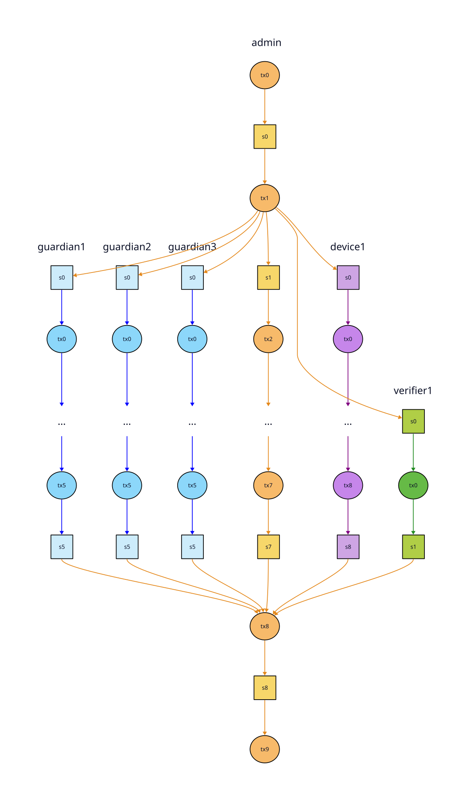

# Tour of the electionguard-cardano validator code

In this first MVP version of the ElectionGuard + Cardano system, the on-chain code serves two purposes, both related to limiting the power of the government (AKA election administrator) by decentralizing some of their duties:

1. The contract acts as the "public, append-only bulletin board". In traditional non-blockchain ElectionGuard deployments, this would just be a website. Decentralizing it removes the temptation for the admin to alter records or take the site down if they don't like how the election is going, and reduces their exposure to being hacked or DDOSed.

2. The contract also makes it easier for the head administrator to delegate authority. Instead of one monolithic "election system" the public can see the admin assigning other keys to particular roles (guardian, ballot encryption device, official verifier) and knows which one(s) signed each election artifact.

There are many other things the blockchain would also be useful for, but they're left for future iterations:

- uncensorable disputes and transparent dispute resolution
- provably random (unbiased) risk-limiting audits
- collateral/slashing to improve trust in election officials
- incentives for 3rd parties to serve IPFS data and run verifiers + dashboards
- ...

## Files

Here's an overview of all the validator code so far.
It's split into the production code and test suite:

```
onchain/validators
├── election.ak
├── election
│   ├── auth.ak
│   ├── cont.ak
│   ├── fund.ak
│   ├── mint.ak
│   ├── stt.ak
│   ├── types
│   │   ├── action.ak
│   │   ├── ballot_id.ak
│   │   ├── channel.ak
│   │   ├── channel_id.ak
│   │   ├── ipfs_cid.ak
│   │   ├── phase.ak
│   │   └── record.ak
│   └── utils.ak
└── tests
    ├── mock.ak
    ├── action
    │   ├── burntesttokens.ak
    │   └── burntesttokens.tests.ak
    ├── data
    │   └── static_records.ak
    ├── integration
    │   ├── happy_adminchannel.ak
    │   ├── happy_adminchannel.tests.ak
    │   ├── happy_election.ak
    │   ├── happy_election.tests.ak
    │   ├── happy_postpublicrecords.ak
    │   ├── happy_postpublicrecords.tests.ak
    │   ├── happy_subchannel.ak
    │   └── happy_subchannel.tests.ak
    └── unit
        ├── action.tests.ak
        ├── ballot_id.tests.ak
        ├── ipfs_cid.tests.ak
        ├── record.tests.ak
        └── state.tests.ak
```

```
validators
├── election.ak           # The main validator
├── election              # Definitions factored out of the main validator
│   ├── *.ak              # Somewhat-modular functions grouped by topic
│   └── types/*.ak        # Data types and functions for working on them
└── tests
    ├── mock.ak           # Library of test helper functions
    ├── action/*.ak       # Single-action tests
    ├── data/*.ak         # Static election artifacts generated by a Python script
    ├── integration/*.ak  # Integration tests
    └── unit/*.ak         # Unit tests
```

Within the production code `election.ak` is the final validator. Data types are defined in `election/types/*.ak`, and the rest of the code is under `election/*.ak` grouped roughly by "aspect".

The test suite is organized into `mock.ak` which is a little library of helper functions. `data` holds statically generated test data, and then the rest of the folders are tests by type:

- unit tests
- single-action tests
- integration tests

The current integration tests are "happy path" tests that confirm the full contract lifecycle works. They start with `happy_`. Later, others can be added to check that the validator rejects all attempts at invalid state transitions. The happy path tests are a good starting point for that, because each invalid state can be reached by starting from one of the valid states and doing one thing wrong.

## Visualizing the on-chain data

Cardano smart contracts can be tricky to visualize because they don't construct transactions; they only decide whether a given transaction is valid or not. So the simplest way to start is with an example of the data structure they're trying to force the off-chain code to create. In this case it's a multithreaded pubsub channel:



Each channel has a state thread token (STT), and each state `s0`, `s1`, ... `sN` contains a list of zero or more new public records.

There's always one admin channel. The admin can post records to it, as well as update a couple other bits of special admin state, and mint or burn subchannel tokens.

Each subchannel has one authorized publisher, and the only thing they can do is to post public records.

## Public Records

Leaving the admin channel aside for a minute, most transactions are simple: one of the subchannel publishers posts a list of public records to their channel. In the case of a ballot encryption device, the list might look like:

```aiken
[
  PublicRecord {
    ipfs_cid: #"0155122023f9c548fcfc4d6cab3665aea8c1d4ab436cf284f34148cc8c32f3f0cff5b166",
    metadata: BallotSubmitted {
      ballot_id: to_bytearray(@"ballot-4b4fb8a6-1d64-11f1-a997-768fd7ed4145")
    }
  },
  PublicRecord {
    ipfs_cid: #"0155122017fd845417e179f8a0f8bb69fca3b3c428a14a97b3d6fc982390a372275acfcb",
    metadata: BallotSubmitted {
      ballot_id: to_bytearray(@"ballot-4c9f842a-1d64-11f1-94d0-768fd7ed4145")
    }
  },
  PublicRecord {
    ipfs_cid: #"01551220b2fe6231a43ea31a09df0e6277e8ebca319e77f089fa169053a264b6a9d13b9b",
    metadata: BallotSpoiled {
      ballot_id: to_bytearray(@"ballot-48b5dc74-1d64-11f1-9b1b-768fd7ed4145")
    }
  },
  PublicRecord {
    ipfs_cid: #"01551220f9bba653cd2cd599b0d83ae8965b7596dfc5875e2eee3161f0db89367f1c10e5",
    metadata: CastNotice {
      ballot_id: to_bytearray(@"ballot-4957f5fe-1d64-11f1-9226-768fd7ed4145")
    }
  }
]
```

That's two newly scanned ballots being submitted, one previously submitted ballot being "spoiled" (AKA audited or marked for public decryption) by the voter, and one previously submitted ballot being cast (marked for inclusion in the final tally) by the voter.

All records include an IPFS CID and some metadata. The possible metadata types are [here](../onchain/validators/election/types/record.ak).

Each update (datum) only includes the latest batch of `new_records`. Observers or other node operators need to run a Kupo indexer to get the full history. There's no way around the general requirement to run a custom node, because it also needs to fetch files via IPFS in order to confirm that the current election state is valid.

## Election Phases

Each election is broken into a series of standard phases defined [here](../onchain/validators/election/types/phase.ak):

1. Config

    1. Announce
    2. Onboarding
    3. Key Ceremony
    
2. Voting
3. Results

     1. Tally
     2. Decrypt
    
4. Verify
5. Finalize

These are good for adding phase-specific logic to the contract. For example ADA can't be removed except by the admin during `Finalize` (see [funding](#funding) below). They'll also be useful for displaying progress in a future UI, and for controlling which actions are available to each person/role at any given time.

## Funding Transaction Fees

The contract is set up to minimize the amount of ADA that needs to be handled by election officials. The expected workflow is:

1. The admin locks a pool of ADA with each channel STT to pay for fees.
2. The admin sends a little more ADA to the publisher to be used as smart contract collateral (that bit can't be provided by the contract).
3. Posting can be done for free using the channel ADA.
4. If needed, the admin can top up a channel or rebalance between channels at any point.
5. At the end of the election the admin can remove the remaining ADA. There could be custom treasury related logic here in the future.
6. There's currently no mechanism to recover the collateral; publishers can keep it.

Most of that is handled by the off-chain code that constructs transactions, and by the Cardano ledger. The contract just ensures is that no one can take the ADA associated with a channel during the election. That's handled [here](../onchain/validators/election.ak#L428) and [here](../onchain/validators/election/fund.ak#L13). There's also a `RebalanceFunds` action for the admin, which is almost a no-op except that it needs to update the admin STT + each subchannel STT being rebalanced.

## Burning Test Tokens

When I first started working with the testnet, I accidentally made a few unspendable (or not easily spendable) test tokens. The current version of the contract includes a `BurnTestTokens` action (redeemer) to prevent that. Whenever one of the tests hits an unexpected issue, I'll run the burn script to clean it up. Obviously this part should be removed before production use!

## Admin actions

Now you know enough to understand [all the action (redeemer) types](../onchain/validators/election/types/action.ak) and the . They're grouped in the source code by which channels they touch, but would typically be used in this order by the admin:

1. InitElection
2. PostPublicRecords
3. AddSubChannels
4. AdvancePhase
5. RmSubchannels
6. EndElection

## Channel State

There are two types of channel states, defined [here](../onchain/validators/election/types/channel.ak): `AdminChannelState` and `SubChannelState`.

Both types have one `VerificationKeyHash` (wallet key) authorized to update them, but it's called `admin` in the admin channel and `publisher` in subchannels.

Both also have `new_records` lists that work the same way (they're replaced each update). They also have `seq` variables that will be used by clients subscribing to updates. They'll make it easy to check that no updates have been skipped, and easy to roll back in case the chain reorganizes.

The admin one has an extra `phase` variable as well as a `subchannels` list, while the subchannel one has a `channel_id`.

The admin channel posts a mix of channel/election related state updates, as well as public records. Subchannels only post public records.
