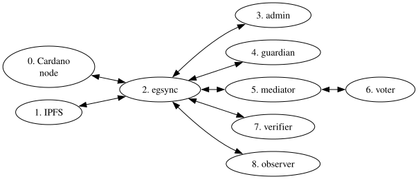

# Software Architecture Brainstorm

Just some initial ideas...

[CLI Print and scan QR Codes](./qrcodes.md)

## Networks

These images could be arranged into all the things I know I'll want so far.

| Network | Nodes |
| --- | --- |
| admin | 0,1,2,3 |
| guardian | 0,1,2,4 |
| voter | 0,1,2,5,6 |
| verifier | 0,1,2,7 |
| observer | 0,1,2,8 |

I just made up the "voter", "verifier", and "observer" roles.

Observer would be a combination of visualizing the current state of an election and checking for inclusion of your specific vote. They don't need to be combined, but it might be convenient.

What should the networks be implemented with? I'm kind of assuming docker-compose here, but each "network" could also be a single Docker image with a different entrypoint script.

I'm not sure IPFS needs to be a node in the networks; the others could just access `ipfs://` URLs without making it part of the local network. But maybe it would be easier to manage traffic this way?

### Duplication

There should be different configurations for different scenarios:

- One Cardano node and multiple egsync instances to test the egsync syncing
- Multiple Cardano node + egsync instances to test the node syncing
- Multiple IPFS + egsync instances to test IPFS syncing
- One Cardano, one IPFS, one egsync, multiple guardians to test key ceremony
- One Cardano, one IPFS, one egsync, one verifier to test verification
- ...

Are there any good rules of thumb here?

### Test runner(s)

I don't think I need an image to run tests, because those are better handled at the top host machine level. They should be able to control Docker.
