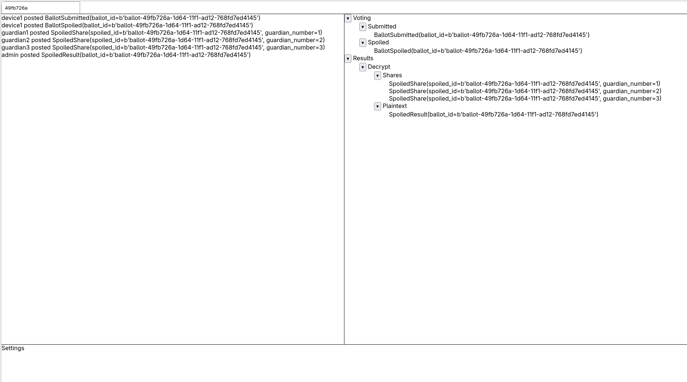

EG+C WebUI
==========

Work in progress, but seems very promising!

Uses Quart (fork of Flask with async support) as the backend and HTMX for the
frontend. Only a subscriber so far---no publisher or action buttons etc yet.

<a href="egc-webui-wip.png"></a>

Usage:

```
# terminal 1:
cd ../milestone2/publish-and-verify
docker compose up -d
nix develop .#offchain
./publish.sh
docker compose down
```

```
# terminal 2:
nix develop
./webui.sh
```
